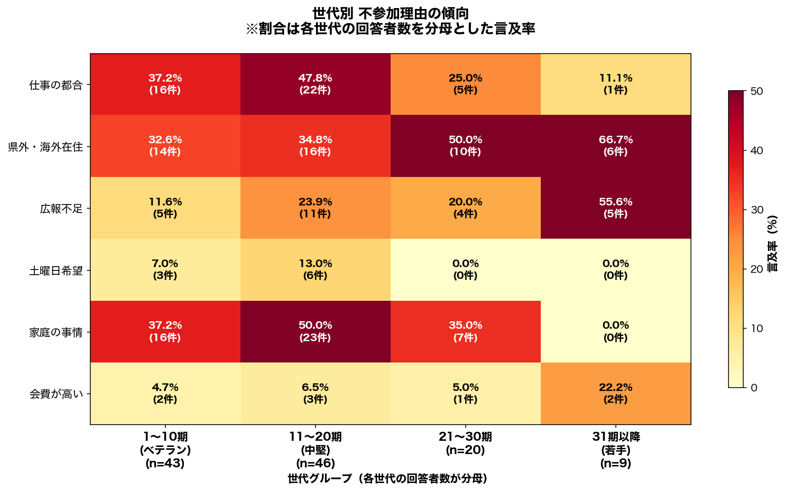

# 不参加理由の世代別分析

### 世代別 不参加理由の分析

#### 世代別の特徴

**1〜10期 (ベテラン)** (n=43)
- 最も多い理由: **仕事の都合** (37.2%)
- 平均言及率: 21.7%

**11〜20期 (中堅)** (n=46)
- 最も多い理由: **家庭の事情** (50.0%)
- 平均言及率: 29.3%

**21〜30期** (n=20)
- 最も多い理由: **県外・海外在住** (50.0%)
- 平均言及率: 22.5%

**31期以降 (若手)** (n=9)
- 最も多い理由: **県外・海外在住** (66.7%)
- 平均言及率: 25.9%

#### 不参加理由別の世代間差異

**仕事の都合**
- 世代間差: 36.7ポイント
- 最多: 11〜20期 (中堅) (47.8%)
- 最少: 31期以降 (若手) (11.1%)

**県外・海外在住**
- 世代間差: 34.1ポイント
- 最多: 31期以降 (若手) (66.7%)
- 最少: 1〜10期 (ベテラン) (32.6%)

**広報不足**
- 世代間差: 43.9ポイント
- 最多: 31期以降 (若手) (55.6%)
- 最少: 1〜10期 (ベテラン) (11.6%)

**土曜日希望**
- 世代間差: 13.0ポイント
- 最多: 11〜20期 (中堅) (13.0%)
- 最少: 21〜30期 (0.0%)

**家庭の事情**
- 世代間差: 50.0ポイント
- 最多: 11〜20期 (中堅) (50.0%)
- 最少: 31期以降 (若手) (0.0%)

**会費が高い**
- 世代間差: 17.6ポイント
- 最多: 31期以降 (若手) (22.2%)
- 最少: 1〜10期 (ベテラン) (4.7%)

#### 主要な発見

1. **若手層（31期以降）の特徴**: 県外・海外在住が最も多い（66.7%）
2. **ベテラン層（1〜10期）の特徴**: 仕事の都合が最も多い（37.2%）
3. **広報不足の世代差**: 31期以降 (若手)で最も高い（55.6%）→ 若手への広報強化が必要
4. **会費の影響**: 全体的に低い（最大22.2%）→ 会費は主要な障壁ではない