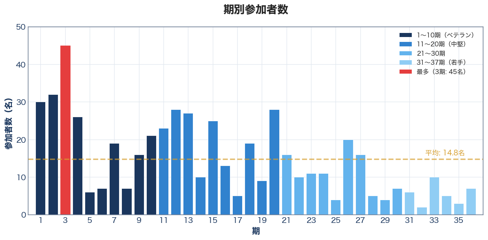
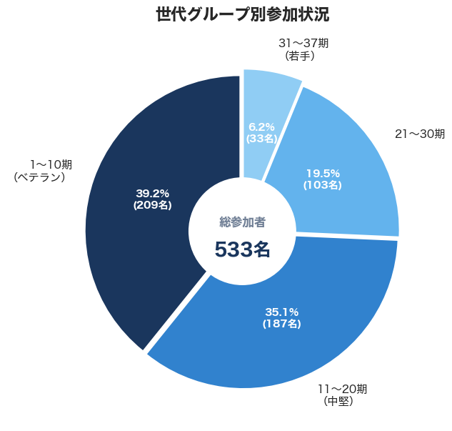
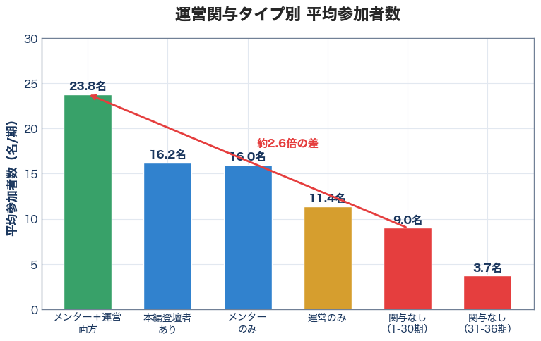
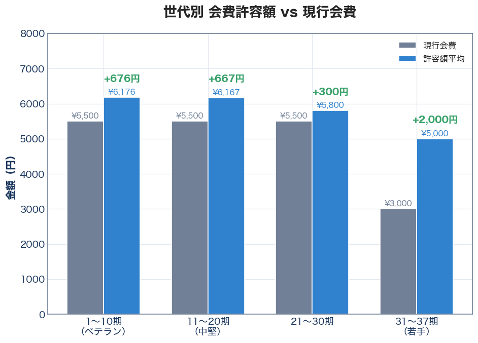
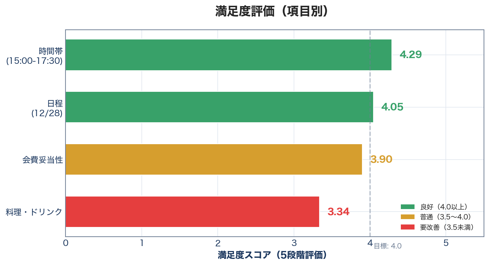
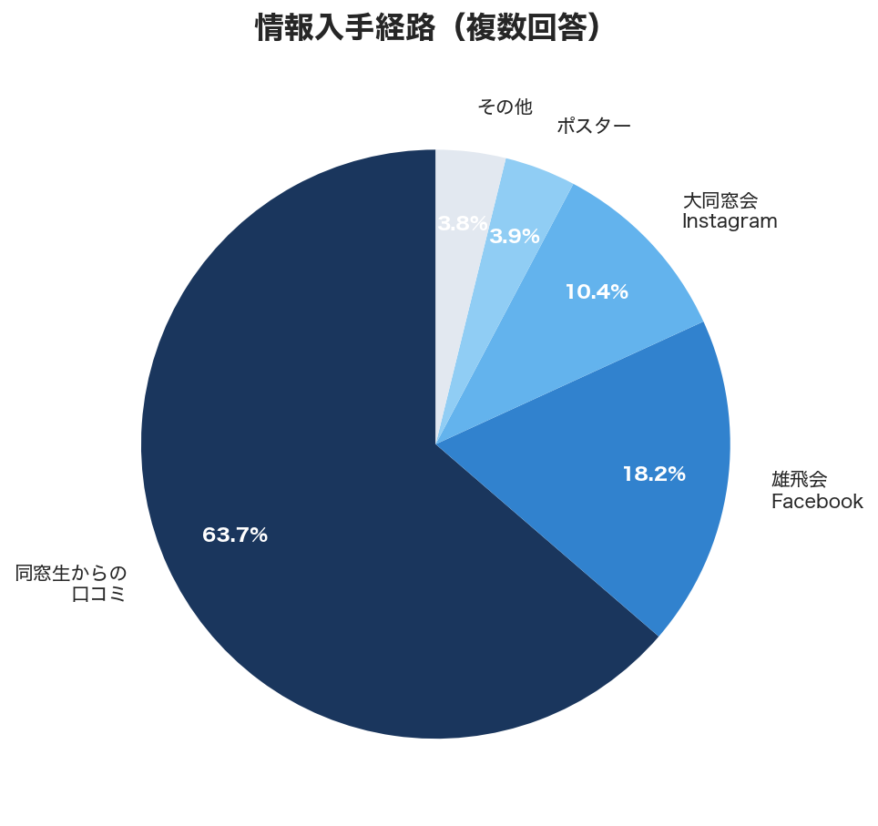
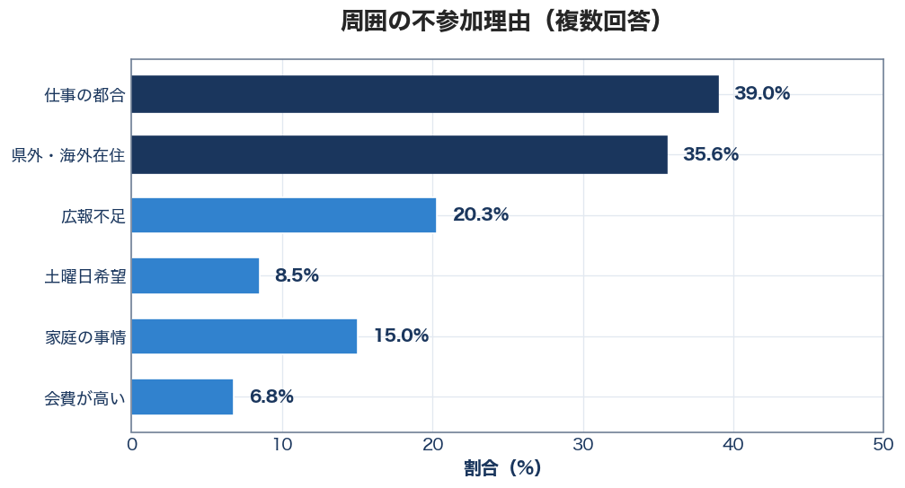
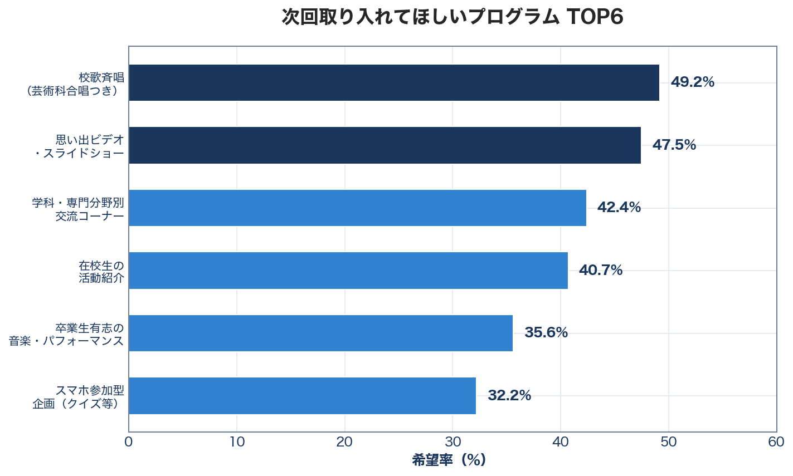
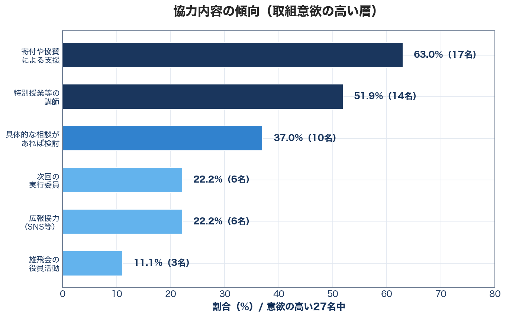

# 第3回 開邦高校大同窓会 データ分析レポート
## 次回開催への施策提言

---

## 目次

- [エグゼクティブサマリー](#エグゼクティブサマリー)
- [現行会費体系](#現行会費体系)
- [1. 期別参加者分析](#1-期別参加者分析)
  - [1.1 期別参加者数](#11-期別参加者数)
  - [1.2 世代グループ別参加状況](#12-世代グループ別参加状況)
  - [1.3 参加者が多い期・少ない期](#13-参加者が多い期少ない期)
  - [1.4 登壇者・運営メンバーの有無と参加者数の関係](#14-登壇者運営メンバーの有無と参加者数の関係)
  - [1.5 申込時期の時系列分析](#15-申込時期の時系列分析)
  - [1.6 事前申込締切日の最適化分析](#16-事前申込締切日の最適化分析)
  - [1.7 スポンサー協賛と参加者数・満足度の関係](#17-スポンサー協賛と参加者数満足度の関係)
- [2. 会費分析と傾斜設計への示唆](#2-会費分析と傾斜設計への示唆)
  - [2.1 現行区分別の満足度と許容額](#21-現行区分別の満足度と許容額)
  - [2.2 さらに細分化した分析](#22-さらに細分化した分析)
  - [2.3 傾斜への意見（自由回答より）](#23-傾斜への意見自由回答より)
  - [2.4 傾斜シミュレーション](#24-傾斜シミュレーション)
  - [2.5 推奨会費体系（次回）](#25-推奨会費体系次回)
- [3. 満足度分析：課題と対策](#3-満足度分析課題と対策)
  - [3.1 評価項目別スコア](#31-評価項目別スコア)
  - [3.2 自由回答から抽出した課題](#32-自由回答から抽出した課題)
  - [3.3 対策一覧](#33-対策一覧)
- [4. 期別の参加者増加施策](#4-期別の参加者増加施策)
  - [4.1 参加者が少ない期への対策](#41-参加者が少ない期への対策)
  - [4.2 31〜37期（若手）向け施策](#42-3137期若手向け施策)
  - [4.3 ベテラン層（1〜10期）向け施策](#43-ベテラン層110期向け施策)
- [5. 広報・集客戦略](#5-広報集客戦略)
  - [5.1 情報入手経路](#51-情報入手経路)
  - [5.2 不参加理由と対応](#52-不参加理由と対応)
- [6. 希望プログラムと開催条件](#6-希望プログラムと開催条件)
  - [6.1 希望プログラムTOP8](#61-希望プログラムtop8)
  - [6.2 開催条件の希望](#62-開催条件の希望)
- [7. 施策優先度まとめ](#7-施策優先度まとめ)
  - [7.1 すぐやるべき（高効果・低コスト）](#71-すぐやるべき高効果低コスト)
  - [7.2 計画的に実施（高効果・中コスト）](#72-計画的に実施高効果中コスト)
- [8. 次回開催への提言](#8-次回開催への提言)
  - [8.1 会費設計（推奨）](#81-会費設計推奨)
  - [8.2 参加者数目標](#82-参加者数目標)
  - [8.3 開催条件](#83-開催条件)
  - [8.4 登壇者・運営メンバー配置戦略](#84-登壇者運営メンバー配置戦略)
  - [8.5 協賛獲得戦略](#85-協賛獲得戦略)
  - [8.6 協賛金の運営費充当と個人協賛オプション](#86-協賛金の運営費充当と個人協賛オプション)
  - [8.7 今後の取組意欲が高い層の特徴と活用戦略](#87-今後の取組意欲が高い層の特徴と活用戦略)
- [付録: 期別詳細データ](#付録-期別詳細データ)

---

## エグゼクティブサマリー

| 項目 | 数値 |
|-----|------|
| 参加者数 | **533名** |
| アンケート回答数 | 59名（回収率11.0%） |
| 推定会費収入 | **約285万円** |
| 料理満足度 | **3.34/5.0**（最重要課題） |

---

## 現行会費体系

| 区分 | 前売り | 当日 | 参加者数 |
|-----|-------|-----|---------|
| 1〜30期 | 5,500円 | 7,000円 | 500名 |
| 31〜37期 | 3,000円 | 4,000円 | 33名 |

**推定収入**: 500名×5,500円 + 33名×3,000円 = **約285万円**

---

## 1. 期別参加者分析

### 1.1 期別参加者数



### 1.2 世代グループ別参加状況



| グループ | 参加者数 | 構成比 | 平均/期 |
|---------|---------|-------|--------|
| 1〜10期（ベテラン） | 209名 | **39.2%** | **20.9名** |
| 11〜20期（中堅） | 187名 | 35.1% | 18.7名 |
| 21〜30期 | 104名 | 19.5% | 10.4名 |
| 31〜37期（若手） | 33名 | 6.2% | 4.7名 |

**発見**:
- **ベテラン層（1〜10期）が約4割**を占め、イベントを牽引
- **3期が45名で突出** → 同期の結束力が特に強い
- **31〜37期は33名のみ**（全体の6%）→ 若手集客が課題

### 1.3 参加者が多い期・少ない期

**TOP5（成功事例）**
| 期 | 参加者 | 推定要因 |
|---|-------|---------|
| 3期 | 45名 | 同期の結束、幹事の存在 |
| 2期 | 32名 | 開校初期の連帯感 |
| 1期 | 30名 | 1期生のアイデンティティ |
| 12期 | 28名 | 卒業25年のまとまり |
| 20期 | 28名 | SNS世代、連絡網機能 |

**BOTTOM5（要強化）**
| 期 | 参加者 | 推定要因 |
|---|-------|---------|
| 32期 | 2名 | コロナ禍卒業、同期会未経験 |
| 35期 | 3名 | まだ大学生 |
| 25期 | 4名 | 連絡網の断絶 |
| 5期・6期 | 6-7名 | 同期ネットワークが弱い |

### 1.4 登壇者・運営メンバーの有無と参加者数の関係



今回、本編登壇者・事前イベントメンター・運営メンバーを期や学科を分散させて配置した。
その関与の有無と参加者数の関係を分析した。

**関与タイプ別の期一覧**

| 関与タイプ | 該当期 |
|-----------|-------|
| 本編登壇者 | 2, 6, 13, 22, 23, 33期（6期） |
| 事前イベントメンター | 1, 3, 4, 7, 8, 12, 13, 14, 15, 18, 20, 21, 24, 26, 36期（15期） |
| 運営メンバー | 3, 4, 6, 7, 10, 11, 12, 13, 14, 15, 16, 17, 18, 19, 20, 23, 24, 25, 34期（19期） |
| **何らかの関与あり** | **計27期** |
| **関与なし** | 5, 9, 27, 28, 29, 30, 31, 32, 35期（**計9期**） |

**関与タイプ別の参加者数**

| 関与タイプ | 対象期数 | 平均参加者 |
|-----------|---------|----------|
| **メンター＋運営両方** | 10期 | **23.8名** |
| 本編登壇者あり | 6期 | 16.2名 |
| **運営のみ** | **7期** | **11.4名** |
| メンターのみ | 5期 | 16.0名 |
| **関与なし（1-30期）** | 6期 | **9.0名** |
| 関与なし（31-36期） | 3期 | 3.7名 |

**主要な発見**

1. **関与あり vs なしで約2.4倍の差**
   - 関与あり期: 平均 **17.3名**/期
   - 関与なし期: 平均 **7.2名**/期
   - 差: **+10.1名/期**

2. **「メンター＋運営」の組み合わせが最も効果的**
   - 3期（45名）、12期（28名）、20期（28名）など
   - 複数の関係者がいると、同期への声がけが活発になる

3. **「運営のみ」は効果が限定的**
   - 運営のみの7期の平均は**11.4名**（メンター＋運営の23.8名の約半分）
   - 運営業務は当日作業が中心のため、事前の同期への声がけ時間が限られる
   - 一方、メンターは事前イベントでの登壇があり、同期に声をかけやすい

4. **例外的なケース**

| 期 | 参加者 | 関与 | 考察 |
|---|-------|-----|-----|
| **6期** | **7名** | 本編登壇+運営 | 関与2種でも1名ずつでは効果限定的 |
| **17期** | 5名 | 運営 | 運営1名では集客効果が薄い |
| **19期** | 9名 | 運営 | 同上 |
| **25期** | 4名 | 運営 | 同上 |
| **34期** | 5名 | 運営 | 同上 |
| **8期** | 7名 | メンター | メンター1名でも効果限定的 |
| **9期** | 16名 | **なし** | 関与なしでも同期の結束力で参加 |
| **27期** | 16名 | **なし** | 同上 |

**因果関係の考察**

```
【仮説A】登壇者・運営がいる → 同期への声がけが増える → 参加者増
【仮説B】結束力が強い期 → 登壇者・運営を出せる → 参加者も多い
```

おそらく**両方が相互に影響**しているが、6期・17期・19期・25期・34期の例から：
- **「関与者1名」では集客効果が限定的**
- **運営のみでは効果薄い（事前の声がけ機会が少ない）**
- **複数名の関与＋メンター（事前イベント参加）が重要**

**期別詳細（関与タイプ付き）**

| 期 | 参加者 | 関与タイプ | 運営人数 |
|---|-------|----------|---------|
| 1期 | 30 | メンター | - |
| 2期 | 32 | **本編登壇** | - |
| 3期 | **45** | メンター, 運営 | 2名 |
| 4期 | 26 | メンター, 運営 | 2名 |
| 5期 | 6 | なし | - |
| 6期 | 7 | **本編登壇**, 運営 | 1名 |
| 7期 | 19 | メンター, 運営 | 1名 |
| 8期 | 7 | メンター | - |
| 9期 | 16 | なし | - |
| 10期 | 21 | 運営 | 1名 |
| 11期 | 23 | 運営 | 1名 |
| 12期 | 28 | メンター, 運営 | 1名 |
| 13期 | 27 | **本編登壇**, メンター, 運営 | **3名** |
| 14期 | 10 | メンター, 運営 | 2名 |
| 15期 | 25 | メンター, 運営 | 2名 |
| 16期 | 13 | 運営 | 1名 |
| 17期 | 5 | 運営 | 1名 |
| 18期 | 19 | メンター, 運営 | 2名 |
| 19期 | 9 | 運営 | 1名 |
| 20期 | 28 | メンター, 運営 | 2名 |
| 21期 | 16 | メンター | - |
| 22期 | 10 | **本編登壇** | - |
| 23期 | 11 | **本編登壇**, 運営 | 1名 |
| 24期 | 11 | メンター, 運営 | 2名 |
| 25期 | 4 | 運営 | 1名 |
| 26期 | 20 | メンター | - |
| 27期 | 16 | なし | - |
| 28期 | 5 | なし | - |
| 29期 | 4 | なし | - |
| 30期 | 7 | なし | - |
| 31期 | 6 | なし | - |
| 32期 | 2 | なし | - |
| 33期 | 10 | **本編登壇** | - |
| 34期 | 5 | 運営 | 1名 |
| 35期 | 3 | なし | - |
| 36期 | 7 | メンター | - |

**運営メンバー詳細（27名）**

| 期 | 氏名 | 学科 |
|---|-----|-----|
| 3期 | 宮城潤（実行委員長）, 上里直司 | 芸術科 |
| 4期 | 喜屋武幸容, 我謝直也 | 理数科 |
| 6期 | 仲筋耕一 | - |
| 7期 | 喜友名智子 | - |
| 10期 | 山下祥子 | - |
| 11期 | 仲間大三 | - |
| 12期 | 堀之内美耶子 | 英語科 |
| 13期 | 国吉聡志, 神谷乗治, 安慶田さとし | 学術探究科/理数科 |
| 14期 | 神谷乗治, 久場章大 | 理数科 |
| 15期 | 又吉吟, 川畑将弥 | 理数科 |
| 16期 | 上間祥子 | 理数科 |
| 17期 | 亀川舞乃 | - |
| 18期 | 當山泰, 大嶺佐紀子 | 理数科 |
| 19期 | 崎原有希 | - |
| 20期 | 上原広大, 知念拓 | - |
| 23期 | 山藤唯美子 | - |
| 24期 | 瀬長卓哉, 玉那覇司 | 理数科 |
| 25期 | 豊島鉄博 | - |
| 34期 | 名嘉山結月 | - |

### 1.5 申込時期の時系列分析

10月末時点の申込者からメンター・運営を選んだため、早期申込者の有無がその後の参加者増加に影響したかを分析した。

**全体の週別推移**

```
週      | 累積 | 新規 | 備考
--------|------|------|------------------
9/21~   |  17名| +17名| チケット販売開始
10/26~  |  92名| +20名| メンター・運営参照時点
11/30~  | 264名| +81名| 後半の伸び開始
12/14~  | 497名|+125名| 駆け込みピーク
12/28   | 533名|  +2名| 当日
```

**早期申込者（10月末まで）のいる期 vs いない期**

| 区分 | 期数 | 平均参加者 | メンター・運営あり |
|-----|-----|----------|-----------------|
| 早期申込者あり | 24期 | **19.1名** | 20期（83%） |
| 早期申込者なし | 12期 | **6.2名** | 7期（58%） |

→ 早期申込者がいない期: 5, 6, 17, 19, 22, 23, 25, 28, 29, 31, 34, 35期

**早期申込数と最終参加者数の相関**
- 相関係数: **0.621**（強い正の相関）
- 早期に申し込む「意欲的なメンバー」がいる期は、最終的な参加者も多い

**早期申込TOP10期の推移**

| 期 | 10月末 | 最終 | 伸び | メンター | 運営 |
|---|-------|------|-----|--------|------|
| 1期 | **10名** | 30名 | +20名 | ○ | - |
| 4期 | **9名** | 26名 | +17名 | ○ | ○ |
| 13期 | **9名** | 27名 | +18名 | ○ | ○ |
| 15期 | **9名** | 25名 | +16名 | ○ | ○ |
| 3期 | 6名 | 45名 | **+39名** | ○ | ○ |
| 20期 | 5名 | 28名 | +23名 | ○ | ○ |
| 9期 | 4名 | 16名 | +12名 | - | - |
| 11期 | 4名 | 23名 | +19名 | - | ○ |

**メンター・運営の「呼び込み効果」**

| 区分 | 早期平均 | 後半平均 | 最終平均 | 伸び倍率 |
|-----|---------|---------|---------|---------|
| メンター・運営あり（18期） | 4.3名 | 16.5名 | **20.8名** | 3.8倍 |
| メンター・運営なし（6期） | 2.0名 | 11.8名 | 13.8名 | 5.9倍 |

→ 絶対数では「あり」が+7.0名多い（20.8 vs 13.8）

**12月の駆け込み申込**

| 区分 | 12月申込平均 |
|-----|------------|
| メンター・運営あり | **10.3名** |
| メンター・運営なし | 7.6名 |

**主要な発見**

1. **早期申込者がいる期は最終参加者が3倍多い**（19.1名 vs 6.2名）

2. **早期申込者の83%がメンター・運営に選ばれている**
   - 選考プロセスが「意欲的な期」を自然に抽出

3. **メンター・運営は12月の「駆け込み」を+2.7名増やしている**
   - 事前イベント（12/28午前）の告知が同期への声がけにつながった

4. **因果関係の整理**
   ```
   早期申込者がいる → メンター・運営に選ばれる → 同期に声がけ → 後半に申込増加
   ```

### 1.6 事前申込締切日の最適化分析

運営施策として「11月末までに申込を」と周知し、当初締切12/15を12/22に延長した。この効果と最適な締切日を分析。

**週別申込推移と締切効果**

```
日付    | 申込 | 累積  | 備考
--------|------|-------|------------------
11/30   |  12名| 195名 | 料理プラン確定目安
12/14   |  43名| 415名 | 締切前日
12/15   |  60名| 475名 | ★当初締切（駆け込み）
12/16   |   6名| 481名 | 締切翌日（急減）
12/22   |  19名| 523名 | ★延長締切
12/28   |   2名| 533名 | 当日
```

**締切効果の数値**
- 12/15（当初締切日）: 60名（通常の**1.9倍**）
- 締切翌日（12/16）: 6名に急減
- 延長締切（12/22）: 19名の駆け込み

**期間別申込数**

| 期間 | 申込数 | 1-30期 | 31-37期 |
|-----|-------|-------|---------|
| 〜11/30 | 195名 | 186名 | 9名 |
| 12/1〜12/15（当初締切） | 280名 | 257名 | 23名 |
| 12/16〜12/22（延長期間） | 48名 | 48名 | 0名 |
| 12/23〜12/27 | 8名 | 7名 | 1名 |
| 12/28（当日） | 2名 | 2名 | 0名 |

**締切延長の収益影響**

| シナリオ | 前売り | 当日 | 収入 |
|---------|-------|------|------|
| 12/15締切（当初） | 475名 | 58名 | ¥2,935,500 |
| 12/22締切（実際） | 523名 | 10名 | ¥2,863,500 |
| **差額** | - | - | **-72,000円** |

→ 延長により48名が前売りになり、当日券との差額1,500円×48名=72,000円の減収

**損益分岐点の計算**

```
【前提】
  前売り: 5,500円（1-30期）
  当日券: 7,000円（1-30期）
  差額: 1,500円/人

【トレードオフ】
  締切を早める → 当日券が増えて収入増（+1,500円/人）
  締切を早める → 諦める人が増えて収入減（-5,500円/人）

【損益分岐】
  1人が当日券 = +1,500円
  1人が諦める = -5,500円

  → 3.7人中1人でも諦めると損失
  → 離脱率27%が損益分岐点
```

**締切日×離脱率マトリクス（収入）**

| 締切日 | 離脱0% | 離脱20% | 離脱40% | 損益分岐 |
|-------|--------|---------|---------|---------|
| 12/14 | 301万円 | 285万円 | 269万円 | 離脱19% |
| 12/15 | 292万円 | 284万円 | 276万円 | 離脱16% |
| 12/22 | 286万円 | 285万円 | 283万円 | - |

**参加者数×離脱率マトリクス**

| 締切日 | 離脱0% | 離脱20% | 離脱40% | 離脱60% |
|-------|--------|---------|---------|---------|
| 12/14 | 533名 | 509名 | 485名 | 462名 |
| 12/15 | 533名 | 521名 | 509名 | 498名 |
| 12/22 | 533名 | 531名 | 529名 | 527名 |

**結論と推奨**

| KPI | 最適締切 | 理由 |
|-----|---------|------|
| 参加者数最大化 | **12/20〜22** | 離脱リスク最小 |
| 収益最大化 | **12/14〜15** | 当日券比率増 |
| バランス重視 | **12/15〜17** | 締切効果＋リスク許容 |

**次回への提言**

1. **推奨締切日: 開催12〜14日前**
   - 締切効果で駆け込み申込が増える（今回103名）
   - 運営準備に2週間の余裕

2. **「延長なし」を徹底**
   - 延長すると締切効果が薄れる
   - 信頼性確保のため延長しない

3. **離脱リスクの緩和策**
   - 「締切後も当日参加可能」と明示
   - 当日券が割高であることを周知
   - 料理手配の関係で人数確定が必要と説明

4. **期待収益効果**
   - 離脱率20%以下を維持できれば+5〜10万円増収
   - 延長なしの実績を作れば、次回の離脱率は低下

---

### 1.7 スポンサー協賛と参加者数・満足度の関係

法人・個人協賛の期別データを分析し、参加者数・満足度との関係を調査した。

**協賛のある期（15期）**

| 期 | 参加者 | 協賛額 | 協賛件数 |
|---|-------|--------|---------|
| 13期 | 27名 | ¥200,000 | 4件 |
| 4期 | 26名 | ¥137,000 | 4件 |
| 3期 | 45名 | ¥120,000 | 2件 |
| 1期 | 30名 | ¥100,000 | 1件 |
| 10期 | 21名 | ¥100,000 | 1件 |
| 20期 | 28名 | ¥97,000 | 1件 |
| 18期 | 19名 | ¥90,000 | 3件 |
| 14期 | 10名 | ¥80,000 | 2件 |
| 7期 | 19名 | ¥70,000 | 3件 |
| 6期 | 7名 | ¥40,000 | 1件 |
| 15期 | 25名 | ¥40,000 | 1件 |
| 9期 | 16名 | ¥30,000 | 2件 |
| 5期 | 6名 | ¥20,000 | 2件 |
| 2期 | 32名 | ¥10,000 | 1件 |
| 8期 | 7名 | ¥10,000 | 1件 |

**協賛あり vs なしの比較**

| 指標 | 協賛あり（15期） | 協賛なし（21期） | 差 |
|-----|----------------|----------------|-----|
| **参加者数** | 318名（平均21.2名/期） | 215名（平均10.2名/期） | **+107%** |
| **料理満足度** | 3.50/5.0 | 3.05/5.0 | +0.45 |
| **会費満足度** | 4.13/5.0 | 3.48/5.0 | +0.65 |

**高額協賛 vs 少額協賛**

| 区分 | 対象期 | 平均参加者 |
|-----|-------|----------|
| 高額（5万円以上） | 9期 | **25.0名** |
| 少額（5万円未満） | 6期 | 15.5名 |

**協賛+メンター+運営のトリプル効果**

| 期 | 参加者 | 協賛額 | メンター | 運営 |
|---|-------|--------|--------|------|
| 3期 | **45名** | ¥120,000 | ○ | ○ |
| 20期 | 28名 | ¥97,000 | ○ | ○ |
| 13期 | 27名 | ¥200,000 | ○ | ○ |
| 4期 | 26名 | ¥137,000 | ○ | ○ |
| 15期 | 25名 | ¥40,000 | ○ | ○ |
| 7期 | 19名 | ¥70,000 | ○ | ○ |
| 18期 | 19名 | ¥90,000 | ○ | ○ |
| 14期 | 10名 | ¥80,000 | ○ | ○ |
| **平均** | **24.9名** | - | - | - |

**主要な発見**

1. **協賛あり期は参加者が約2倍**
   - 協賛を出す期は同期の結束力が強く、声がけも活発

2. **協賛あり期は満足度も高い**
   - 会費満足度が+0.65ポイント高い
   - 「お金を出している」という当事者意識が満足度に影響か

3. **トリプル効果（協賛+メンター+運営）が最強**
   - 8期が該当し、平均24.9名/期
   - 金銭的・人的両面での関与が相乗効果を生む

4. **因果関係の考察**
   ```
   【仮説A】協賛する → 同期を誘う → 参加者増
   【仮説B】結束力が強い → 協賛も出せる・参加者も多い
   ```
   おそらく両方が相互に影響している

---

## 2. 会費分析と傾斜設計への示唆

### 2.1 現行区分別の満足度と許容額

| 区分 | 現行会費 | 会費満足度 | 平均許容額 | 内容重視派 |
|-----|---------|----------|----------|----------|
| 1〜30期 | 5,500円 | **3.98** | **6,089円** | 18.2% |
| 31〜37期 | 3,000円 | **2.75** | 5,000円 | 0% |

**重要な発見**:
- **1〜30期は許容額6,089円** → 現行5,500円より**+589円の増額余地**
- **31〜37期の満足度が2.75と低い** → しかし許容額は5,000円（現行より+2,000円）
  - これは「会費が高い」ではなく、**「安い会費相応の内容への不満」**の可能性

### 2.2 さらに細分化した分析



| グループ | 参加者 | 会費満足度 | 許容額 | 内容重視派 | 現行との差 |
|---------|-------|----------|-------|----------|----------|
| 1〜10期 | 209名 | **4.25** | **6,176円** | **29.2%** | **+676円** |
| 11〜20期 | 187名 | 3.81 | 6,167円 | 14.3% | +667円 |
| 21〜30期 | 104名 | 3.70 | 5,800円 | 0% | +300円 |
| 31〜37期 | 33名 | 2.75 | 5,000円 | 0% | +2,000円 |

**キーインサイト**:
1. **ベテラン（1〜10期）は増額に寛容**
   - 29.2%が「金額より内容重視」と回答
   - 会費満足度4.25と高く、現行に不満なし
   - **7,000円程度まで増額可能**

2. **中堅（11〜20期）も増額余地あり**
   - 許容額6,167円、現行比+667円
   - 「年次別傾斜があると良い」という肯定的意見も

3. **21〜30期は現行維持が妥当**
   - 内容重視派0%、価格感度が高い
   - 許容額5,800円 → 現行5,500円は適正範囲

4. **31〜37期は会費ではなく内容が課題**
   - 許容額5,000円と現行3,000円より高い → **会費の安さが不満ではない**
   - 満足度2.75の原因は料理・プログラム内容への不満

### 2.3 傾斜への意見（自由回答より）

> 「金額よりも内容の充実を重視する。かつ、今回のように年次別傾斜があると良いと思います」（20期）

> 「卒業年で値段を変えるのはどうかなぁ？と思いました。卒業したてでも収入の高い人もいれば、私達のような伝統工芸に携わっている人は収入は低いので、5000円でもキツかったです」（8期・芸術科）

→ **傾斜設計は概ね支持されているが、職種による収入差への配慮も必要**

### 2.4 傾斜シミュレーション

| 案 | 会費設計 | 収入 | 現行比 |
|---|---------|-----|-------|
| 現行 | 1-30期:5,500円 / 31-37期:3,000円 | 285万円 | - |
| **案1（推奨）** | 1-10期:6,500円 / 11-20期:6,000円 / 21-30期:5,500円 / 31-37期:3,500円 | **317万円** | **+32万円** |
| 案2 | 1-10期:7,000円 / 11-20期:6,000円 / 21-30期:5,500円 / 31-37期:3,000円 | 326万円 | +41万円 |
| 案3 | 1-10期:6,500円 / 11-30期:5,500円 / 31-37期:3,000円 | 306万円 | +21万円 |

### 2.5 推奨会費体系（次回）

| 区分 | 推奨（前売） | 推奨（当日） | 根拠 |
|-----|------------|------------|-----|
| **1〜10期** | **6,500円** | **8,000円** | 許容額6,176円、内容重視29% |
| **11〜20期** | **6,000円** | **7,500円** | 許容額6,167円 |
| **21〜30期** | **5,500円** | **7,000円** | 現行維持、許容額5,800円 |
| **31〜37期** | **3,500円** | **4,500円** | 内容改善とセットで微増 |

**増収分の使途**: 料理増量・質向上に充当（満足度3.34→4.0目標）

---

## 3. 満足度分析：課題と対策

### 3.1 評価項目別スコア



| 項目 | 平均 | 評価 |
|-----|-----|-----|
| 時間帯(15:00-17:30) | **4.29** | 良好 |
| 日程(12/28) | **4.05** | 良好 |
| 会費妥当性 | 3.90 | 普通 |
| **料理・ドリンク** | **3.34** | **最重要課題** |

### 3.2 自由回答から抽出した課題

| 課題 | 言及数 | 代表的コメント |
|-----|-------|--------------|
| **料理の不足** | 13回 | 「あっという間になくなった」 |
| **音響・聞こえない** | 13回 | 「後方では全く聞こえなかった」 |
| **世代間交流** | 13回 | 「期を超えた交流機会がなかった」 |
| 視認性 | 11回 | 「ステージが低く見えない」 |
| 会場の狭さ | 9回 | 「人数に対して狭い」 |

### 3.3 対策一覧

| 課題 | 対策 | 優先度 | 予算影響 |
|-----|-----|-------|---------|
| **料理不足** | 量を1.5倍に増量、各テーブル配膳 | ★★★ | +30〜50万円 |
| **音響** | スピーカー複数配置、音量調整 | ★★★ | +5〜10万円 |
| 世代間交流 | 職種別・地域別交流コーナー | ★★☆ | ±0 |
| 視認性 | 後方用モニター設置 | ★★☆ | +5万円 |
| 会場狭さ | 600名収容会場を確保 | ★★☆ | 要確認 |

**→ 傾斜強化による増収（+32万円）で料理改善をカバー可能**

---

## 4. 期別の参加者増加施策

### 4.1 参加者が少ない期への対策

**ターゲット期**: 5期, 6期, 8期, 17期, 25期, 28期, 29期, 31-36期

| 施策 | 内容 | 期待効果 |
|-----|-----|---------|
| **期別幹事の設置** | 各期から1名、連絡係を依頼 | 参加者+50名期待 |
| **申込状況の可視化** | 「◯期は現在◯名申込中」を公開 | 「知り合いがいない」不安解消 |
| **同期LINEグループ作成支援** | 運営側で呼びかけ | 継続的ネットワーク構築 |
| **期別早割** | 5名以上同期申込で500円引き | グループ申込促進 |

### 4.2 31〜37期（若手）向け施策

| 施策 | 根拠 |
|-----|-----|
| **内容の充実**を優先 | 会費満足度2.75は「内容への不満」が原因 |
| 会費は3,500円に微増 | 許容額5,000円に対し控えめ設定 |
| Instagram強化 | 若手への到達率13.6% |
| 在校生との連携 | 学校経由の接点活用 |

### 4.3 ベテラン層（1〜10期）向け施策

| 施策 | 根拠 |
|-----|-----|
| **会費増額＋プログラム充実** | 内容重視派29%、「金額より質」 |
| 恩師の登壇、思い出ビデオ | 希望プログラム上位 |
| 座席・休憩スペース確保 | 体力的配慮 |

---

## 5. 広報・集客戦略

### 5.1 情報入手経路



| チャネル | 到達率 | 評価 |
|---------|-------|-----|
| **同窓生からの口コミ** | **83.1%** | **最重要** |
| 雄飛会Facebook | 23.7% | ベテラン向け |
| 大同窓会Instagram | 13.6% | 若手向け |
| ポスター | 5.1% | 効果薄 |

### 5.2 不参加理由と対応



| 不参加理由 | 割合 | 対応策 |
|-----------|-----|-------|
| 仕事の都合 | 39.0% | 土曜開催の検討 |
| 県外在住 | 35.6% | オンライン参加枠 |
| **広報不足** | **20.3%** | **期別連絡網整備** |
| 土曜希望 | 8.5% | 土曜開催の検討 |

---

## 6. 希望プログラムと開催条件

### 6.1 希望プログラムTOP8



| プログラム | 希望率 |
|----------|-------|
| 校歌斉唱（芸術科合唱つき） | 49.2% |
| 当時のスライドショー・思い出ビデオ | 47.5% |
| 学科・専門分野ごとの交流コーナー | 42.4% |
| 在校生の活動紹介 | 40.7% |
| 卒業生有志による音楽・パフォーマンス | 35.6% |
| スマホ参加型企画（クイズ等） | 32.2% |

### 6.2 開催条件の希望

| 項目 | 最多回答 | 割合 |
|-----|---------|-----|
| 開催頻度 | **5年に1回** | 52.5% |
| 開催時期 | **年末年始** | 81.4% |
| 曜日 | 土曜希望 | 33.9% |

---

## 7. 施策優先度まとめ

### 7.1 すぐやるべき（高効果・低コスト）

| 施策 | 効果 |
|-----|-----|
| 期別幹事・連絡網整備 | 参加者+50名 |
| 申込状況のリアルタイム公開 | 申込促進 |
| 会費傾斜の調整 | 収入+32万円 |

### 7.2 計画的に実施（高効果・中コスト）

| 施策 | 効果 |
|-----|-----|
| 料理1.5倍増量 | 満足度向上 |
| 音響設備強化 | プログラム体験向上 |
| 世代間交流プログラム | 大同窓会の価値向上 |

---

## 8. 次回開催への提言

### 8.1 会費設計（推奨）

| 区分 | 前売り | 当日 |
|-----|-------|-----|
| 1〜10期 | 6,500円 | 8,000円 |
| 11〜20期 | 6,000円 | 7,500円 |
| 21〜30期 | 5,500円 | 7,000円 |
| 31〜37期 | 3,500円 | 4,500円 |

**期待収入**: 約317万円（+32万円）→ 料理改善に充当

### 8.2 参加者数目標

| グループ | 今回 | 目標 | 主要施策 |
|---------|-----|-----|---------|
| 1〜10期 | 209名 | 230名 | プログラム充実 |
| 11〜20期 | 187名 | 210名 | 期別連絡網 |
| 21〜30期 | 104名 | 130名 | 連絡網＋SNS |
| 31〜37期 | 33名 | **60名** | 内容改善＋Instagram |
| **合計** | **533名** | **630名** | - |

### 8.3 開催条件

| 項目 | 推奨 |
|-----|-----|
| 時期 | 年末年始（12/27または12/28） |
| 曜日 | **土曜**を優先検討 |
| 会場 | 650名収容可能、天井高確保 |
| 頻度 | 5年に1回（次回2030年） |

### 8.4 登壇者・運営メンバー配置戦略

**今回の分析結果**
- 「メンター＋運営」両方に関与した期: 平均**23.8名**
- 「運営のみ」の期: 平均**11.4名**（効果約半分）
- 関与なしの期: 平均**7.2名**

**効果が限定的だったケース**
| 期 | 参加者 | 関与 | 問題点 |
|---|-------|-----|-------|
| 6期 | 7名 | 本編登壇+運営 | 各1名ずつのため声がけ範囲が限定的 |
| 17期 | 5名 | 運営のみ | 当日作業中心で事前の声がけ機会なし |
| 19期 | 9名 | 運営のみ | 同上 |
| 25期 | 4名 | 運営のみ | 同上 |
| 34期 | 5名 | 運営のみ | 同上 |

**次回の配置方針**

1. **「運営のみ」を避け、「メンター＋運営」のセットを優先**
   - 運営だけでは事前の同期への声がけ機会が少ない
   - メンター（事前イベント）と運営を同じ期から複数名配置

2. **参加が少なかった期への重点配置**
   - 5, 9, 27-32, 35期から**複数名**をメンター・運営に配置
   - 1名だけでは効果薄い（6期・17期等の教訓）

3. **「関与者2名以上」をKPIに**
   - 成功事例: 4期（2名運営）、13期（3名運営）、15期（2名運営）、20期（2名運営）
   - 各期から最低2名以上の関与者を確保

4. **運営メンバーには「事前イベント参加」を推奨**
   - 運営業務だけでなく、事前イベントにも参加することで同期への声がけ機会を増やす

### 8.5 協賛獲得戦略

**今回の分析結果**
- 協賛あり期（15期）: 平均**21.2名**/期
- 協賛なし期（21期）: 平均**10.2名**/期
- 協賛あり期は参加者が**2倍以上**

**トリプル効果（協賛+メンター+運営）**
- 8期が該当し、平均**24.9名**/期
- 最も参加者が多いパターン

**次回の協賛獲得方針**

1. **協賛のない期（21期）をターゲットに**
   - 現在協賛なし: 11, 12, 16, 17, 19, 21-36期
   - 特に参加者が少ない期から優先的にアプローチ

2. **「協賛+メンター+運営」のトリプル関与を目指す**
   - 協賛だけでなく、メンター・運営も同時に依頼
   - 複数の関与で当事者意識を高める

3. **期別協賛（〇期有志）の推進**
   - 18期有志（¥50,000）のように、期単位での協賛を呼びかけ
   - 協賛金額より「期としての参加」を重視

4. **協賛企業リストの活用**
   - 今回の協賛企業（合計約124万円）を次回もリピーター化
   - 代表者に期別の声がけを依頼

### 8.6 協賛金の運営費充当と個人協賛オプション

**現状の収支構造**

| 項目 | 金額 | 備考 |
|-----|------|------|
| チケット収入 | ¥2,849,000 | 533名分 |
| 法人協賛 | ¥1,239,000 | 在校生支援のみ |
| **合計** | **¥4,088,000** | - |

**課題: 参加者の「追加支払い余地」が未活用**

| 世代 | 現行会費 | 許容額平均 | 差額（余地） |
|-----|---------|----------|------------|
| 1-10期 | ¥5,500 | ¥6,176 | **+¥676** |
| 11-20期 | ¥5,500 | ¥6,166 | **+¥666** |
| 21-30期 | ¥5,500 | ¥5,800 | +¥300 |
| 31-37期 | ¥3,000 | ¥5,000 | +¥2,000 |

→ 「内容重視」派: 17%（金額より質を求める層）

**提案1: 協賛金のx%を運営費に充当**

| 充当率 | 運営費充当 | 在校生支援 | 1人あたり効果 |
|-------|----------|----------|-------------|
| 10% | ¥123,900 | ¥1,115,100 | +¥232/人 |
| 20% | ¥247,800 | ¥991,200 | **+¥465/人** |
| 30% | ¥371,700 | ¥867,300 | +¥697/人 |

→ 推奨: 20%充当で料理予算を約10%増額可能

**提案2: Peatixで個人協賛オプション**

```
【チケット種別案（1-30期）】
  1. 通常チケット: ¥5,500
  2. ブロンズ協賛: ¥6,000（+500円が在校生支援）
  3. シルバー協賛: ¥6,500（+1,000円が在校生支援）
  4. ゴールド協賛: ¥7,500（+2,000円が在校生支援）
```

**個人協賛の採用率シミュレーション**

| シナリオ | 寄付者数 | 追加収入 | 寄付率 |
|---------|---------|---------|-------|
| 保守的 | 55名 | ¥44,000 | 10% |
| **中程度** | **102名** | **¥81,600** | **19%** |
| 楽観的 | 148名 | ¥118,400 | 28% |

**提案3: 両方を併用した場合**

| 施策 | 追加運営費 | 1人あたり |
|-----|----------|----------|
| 協賛20%充当 | +¥247,800 | +¥465 |
| 個人協賛（中程度） | +¥81,600 | +¥153 |
| **合計** | **+¥329,400** | **+¥618** |

→ 料理満足度3.34→4.0への改善に必要な予算を確保可能

**実装のメリット**

1. **申込と同時に協賛を募れる**
   - 追加手続き不要、心理的ハードル低下

2. **少額から参加可能**
   - 法人協賛（1万円〜）より敷居が低い
   - +500円なら許容額の範囲内

3. **協賛者数の増加**
   - 現状: 約30法人・個人
   - 提案後: +100名以上
   - 当事者意識の向上

4. **透明性の確保**
   - 「+500円は在校生支援に充当」と明示
   - 協賛者名を当日パンフに掲載

**数値根拠まとめ**

```
現状の未活用余地:
  ・許容額平均 ¥6,000 - 現行 ¥5,500 = ¥500/人
  ・533名 × ¥500 = ¥266,500 の潜在収入

提案による期待収入:
  ・協賛20%充当: ¥247,800
  ・個人協賛: ¥80,000〜120,000
  ・合計: ¥327,800〜367,800

効果:
  ・料理予算 +10〜15%
  ・満足度改善の原資確保
```

### 8.7 今後の取組意欲が高い層の特徴と活用戦略

アンケートで「事務局より連絡を差し上げてもよろしいですか？」に「はい」と回答し、名前・連絡先を提供した人を「取組意欲の高い層」として分析した。

**該当者: 27名 / 全回答者58名（46.6%）**

#### 学科別の傾向

| 学科 | 意欲高い人 | 全回答者 | 割合 |
|------|-----------|---------|------|
| **理数科** | 18名 | 36名 | **50.0%** |
| 芸術科 | 5名 | 13名 | 38.5% |
| 英語科 | 3名 | 8名 | 37.5% |
| 学術探究科 | 1名 | 1名 | 100% |

→ **理数科出身者が最も協力意欲が高い**

#### 期生（世代）の傾向

| 世代グループ | 意欲高い人数 | 構成比 |
|-------------|------------|-------|
| 1〜10期（ベテラン） | 11名 | 40.7% |
| 11〜20期（中堅） | 10名 | 37.0% |
| 21〜30期（若手） | 4名 | 14.8% |
| 31期以降（新世代） | 2名 | 7.4% |

→ **ベテラン・中堅層（1〜20期）が78%を占める**

#### 協力内容の傾向（意欲高い27名の選択）



| 協力内容 | 選択数 | 割合 |
|---------|-------|------|
| **寄付や協賛による支援** | 17名 | **63.0%** |
| **母校の「特別授業」等の講師** | 14名 | **51.9%** |
| 具体的な相談があれば検討したい | 10名 | 37.0% |
| 次回の同窓会実行委員（企画・運営） | 6名 | 22.2% |
| 広報協力（SNS、Web等） | 6名 | 22.2% |
| 同窓会（雄飛会）の役員活動 | 3名 | 11.1% |

→ **金銭的支援と講師活動への意欲が特に高い**

#### 参加したい同窓会活動の傾向

意欲高い層が多く選んでいる活動：
1. **全期規模の大同窓会**（最多）
2. **県外でのネットワーク構築**（県外在住者に需要）
3. **特定の専門分野・職種別の交流会**
4. **オンライン座談会・相談会**
5. **特定テーマのワークショップ**

#### メッセージ入力率と専門分野

意欲高い27名のうち、**21名（77.8%）が任意のメッセージを記入**

**明記された専門分野の例**：
- 金融・投資（奨学金ファンド構築への提案含む）
- エネルギー分野
- 医療系（精神科、産業医）
- 結婚相談・マッチング
- 現代アート制作
- 伝統工芸（沖縄の焼き物）
- 音楽・演奏活動

→ **専門性を明確に持ち、具体的な貢献イメージがある層**

#### 情報源の特徴

意欲高い層の主な情報源：
- **同窓生からの情報**: 22名（81.5%）← 最重要
- 雄飛会Facebook: 8名
- 大同窓会Instagram: 5名

→ **口コミ・人的ネットワーク経由が圧倒的に多い**

#### 会費許容額の傾向

意欲高い層の特徴：
- **「金額よりも内容の充実を重視する」**: 7名（25.9%）← 全体平均（17%）より高い
- 6,000〜7,000円程度を許容する人が多い

→ **価格感度より内容・質を重視**

#### 取組意欲の高い人の典型的プロファイル

```
1. 理数科出身（50%が連絡可と回答）
2. 1〜20期の中堅〜ベテラン世代
3. 専門性を持ち、講師活動に関心がある
4. 寄付・協賛に前向き
5. 口コミで情報を得ている（人的ネットワークが強い）
6. 金額より内容重視の姿勢
7. 具体的な協力可能分野を明記している
```

#### 次回への活用戦略

**優先的にアプローチすべき層**

| 優先度 | 対象 | アプローチ方法 |
|-------|------|--------------|
| 高 | 講師希望者（14名） | 特別授業・事前イベントメンターへの声がけ |
| 高 | 実行委員希望者（6名） | 次回運営メンバーへの早期招集 |
| 中 | 県外在住の協力希望者 | オンラインでの広報・SNS協力依頼 |
| 中 | 専門分野明記者 | 分野別交流会の企画・運営依頼 |

**具体的施策**

1. **講師バンクの構築**
   - 14名の講師希望者をデータベース化
   - 専門分野と連絡先を管理
   - 学校側との連携で特別授業を継続実施

2. **次回運営チームの早期組成**
   - 実行委員希望6名を核に早期招集
   - 参加者が少ない期からの運営メンバー発掘にも活用

3. **協賛獲得への活用**
   - 寄付希望17名への個人協賛オプション案内
   - 法人協賛の紹介依頼

4. **広報ネットワークの構築**
   - 広報協力希望6名をSNS発信チームに組織化
   - 期別・学科別の情報拡散を依頼

**期待効果**

| 施策 | 期待効果 |
|-----|---------|
| 講師バンク活用 | 事前イベント充実、メンター確保 |
| 早期運営チーム組成 | 参加者増（+10.1名/期の効果） |
| 協賛獲得 | 収入増（個人協賛+8〜12万円） |
| 広報協力 | 広報不足（20.3%）の解消 |

---

## 付録: 期別詳細データ

| 期 | 参加者 | 回答 | 料理 | 会費 | 許容額分布 |
|----|-------|-----|-----|-----|----------|
| 1 | 30 | 3 | 3.67 | 4.33 | 6-7千円中心 |
| 2 | 32 | 5 | 3.40 | 3.80 | 5-7千円 |
| 3 | 45 | 4 | 4.50 | 4.75 | 5-6千円、内容重視 |
| 4 | 26 | 6 | 3.00 | 4.50 | 7-8千円 |
| 5 | 6 | 0 | - | - | - |
| 6 | 7 | 0 | - | - | - |
| 7 | 19 | 3 | 4.00 | 4.67 | 5-7千円、内容重視 |
| 8 | 7 | 1 | 1.00 | 2.00 | 5千円（厳しい声） |
| 9 | 16 | 1 | 4.00 | 4.00 | 6千円 |
| 10 | 21 | 1 | 4.00 | 4.00 | 5千円 |
| 11 | 23 | 2 | 2.00 | 3.50 | 6千円 |
| 12 | 28 | 3 | 3.67 | 3.67 | 5-7千円 |
| 13 | 27 | 3 | 3.33 | 4.33 | 6-10千円 |
| 14 | 10 | 1 | 3.00 | 3.00 | 7千円 |
| 15 | 25 | 4 | 3.50 | 3.75 | 6千円中心 |
| 16 | 13 | 2 | 2.50 | 3.50 | 6-7千円 |
| 17 | 5 | 0 | - | - | - |
| 18 | 19 | 1 | 4.00 | 5.00 | 5千円 |
| 19 | 9 | 0 | - | - | - |
| 20 | 28 | 5 | 3.40 | 3.80 | 5-7千円、内容重視 |
| 21 | 16 | 1 | 3.00 | 4.00 | 7千円 |
| 22 | 10 | 0 | - | - | - |
| 23 | 11 | 1 | 2.00 | 3.00 | 5千円 |
| 24 | 11 | 2 | 3.50 | 4.00 | 5-6千円 |
| 25 | 4 | 0 | - | - | - |
| 26 | 20 | 4 | 3.25 | 3.75 | 5-6千円 |
| 27 | 16 | 1 | 4.00 | 4.00 | 7千円 |
| 28 | 5 | 1 | 2.00 | 3.00 | 6千円 |
| 29 | 4 | 0 | - | - | - |
| 30 | 7 | 0 | - | - | - |
| 31 | 6 | 1 | 4.00 | 3.00 | 5千円 |
| 32 | 2 | 1 | 3.00 | 3.00 | 5千円 |
| 33 | 10 | 1 | 3.00 | 3.00 | 5千円 |
| 34 | 5 | 0 | - | - | - |
| 35 | 3 | 0 | - | - | - |
| 36 | 7 | 1 | 3.00 | 2.00 | 5千円 |

---

*分析実施日: 2026年1月9日*
*データソース: Peatix参加者名簿（533名）、Googleフォームアンケート回答（59名）*
